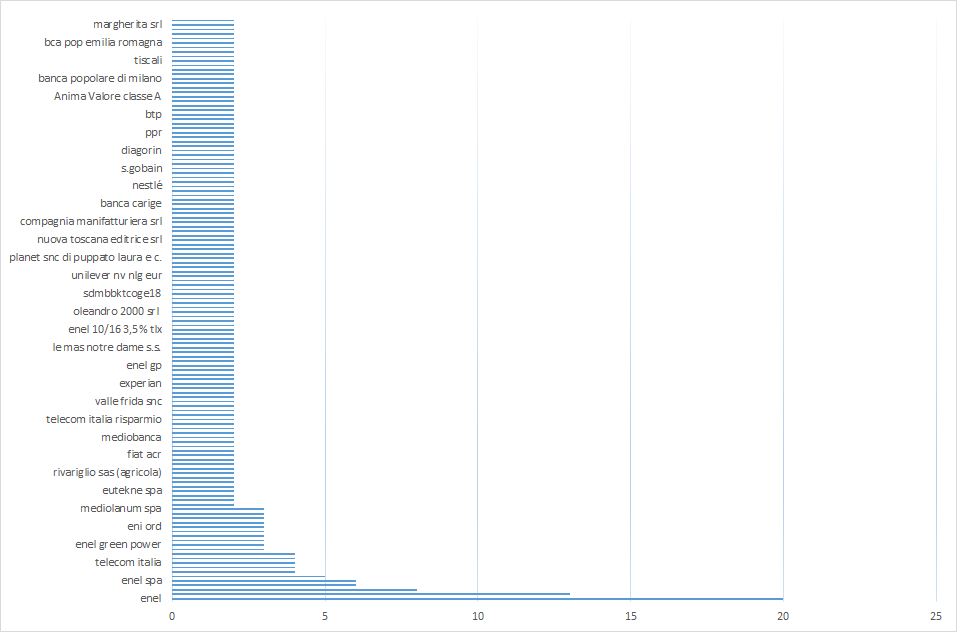

# Openpolis patrimoni scripts 
In this repository I'm collecting some useful scripts to gather and analyze data from [http://patrimoni.openpolis.it](http://patrimoni.openpolis.it) 

## How to use them
Just run scripts using pyhon 3.4.3 using py investments.py
 

## Investments
The aim for [Investments script](src/investments.py) is to get all investments from italian politician in a csv file, so you can use excel or other tool to visualize data, for example:

In this example you can see that many politicians have investments in Enel and Eni

# Future works
I hope to have time explain this scripts and find new way to visualize data

# License
See LICENSE file
